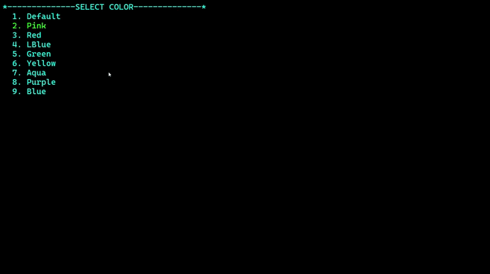
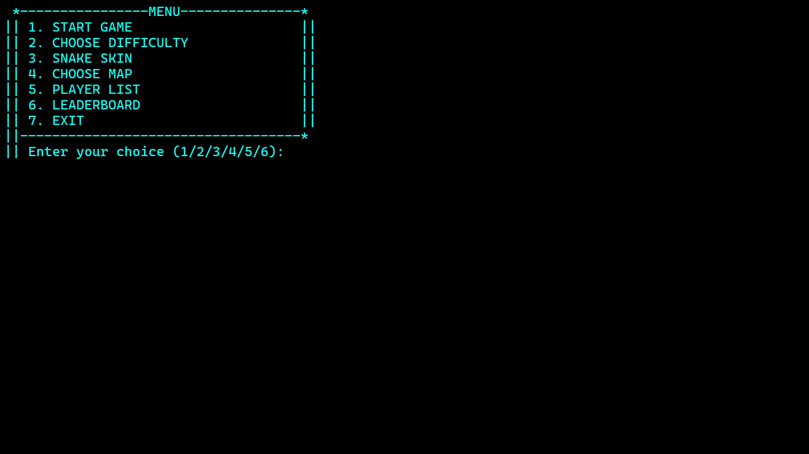

# Snake Console Game 🐍

A simple **Snake Game running in the console**, written as a small project while learning programming fundamentals.

## Features

* Classic snake gameplay
* Console-based interface
* Keyboard controls to move the snake
* Score system
* Game over when the snake hits the wall or its own body
* Simple game menu

## How to Play

* Control the snake using the keyboard
* Eat the food to grow longer and increase your score
* Avoid hitting the wall or your own body

## Controls

* WASD – Move the snake / Move
* Enter – Select menu option

## How to Run

1. Clone the repository

```
git clone https://github.com/cuongquang2006-boop/snake-console-game.git
```

2. Compile the source code

```
g++ main.cpp -o snake
```

3. Run the game

```
./snake
```

## Demo

### Gameplay
<p align="center">
  
</p>

### Game Menu
<p align="center">
  
</p>

## Purpose

This project was created for **learning basic programming concepts**, such as:

* Game loop
* Input handling
* Collision detection
* Simple game logic

## Language

The game interface and messages are written in **English**.

## TODO
- Separate console UI class


## Author

Cunnekba
